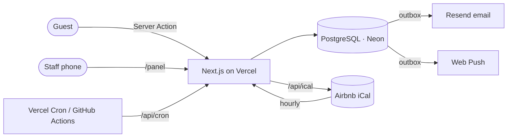

# Trysa — direct bookings for a family-run nature stay

Website, booking system and staff panel for **Trysa Restaurant Camping**, a small family business in Demre, Antalya (6 wooden cabins/rooms, a tiny house, a camping area and a restaurant). Live at [trysacamping.com](https://trysacamping.com).

Before this project, bookings came in through Airbnb or scattered phone and WhatsApp messages. The goal is a direct channel with no commission that a non-technical family can run from a phone. It also has to stay correct when the same room is sold on Airbnb at the same time.

## What it does

**Guests** (Turkish, English, German)
- Browse rooms, restaurant menu, gallery, FAQ and live Google rating
- Send a booking request. Dates that are already taken (Airbnb or confirmed direct bookings) are blocked in the form and re-checked on the server
- Get a request code, optional WhatsApp hand-off and (when enabled) a receipt email in their language

**Staff panel** (`/panel`, mobile-first, installable as a PWA)
- Google sign-in plus an explicit access-approval step (signing in alone grants nothing)
- Push notification on every new request; a reminder if a request waits more than 3 hours
- Confirm / decline with a room picker that shows what is free, with prepared WhatsApp replies in the guest's language
- Add phone, WhatsApp and walk-in bookings by hand, so every booking lives in one place
- Stats: requests, confirmations, median first-response time, WhatsApp/phone clicks, booked nights
- iCal feed per room, so Airbnb blocks dates that were sold directly (two-way calendar sync)

## Architecture



- **Next.js 16 (App Router)** with Server Components and Server Actions. Public pages are statically generated with ISR. The booking page refreshes hourly and is revalidated on demand when staff confirm or cancel.
- **PostgreSQL (Neon) + Drizzle ORM**, versioned SQL migrations applied automatically on production builds (a failed migration fails the deploy, so the old version stays live).
- **Better Auth** (Google) for the panel, sessions stored in the database.

## Engineering decisions

| Problem | Approach |
| --- | --- |
| Double bookings | An `EXCLUDE USING gist` constraint on `(unit_id, daterange)` for confirmed bookings. The database rejects overlaps even under concurrent writes. The shared camping area is exempt. |
| Lost notifications | **Transactional outbox**: the booking, audit event and notification rows are written in one transaction. Delivery retries with exponential backoff and a lease so two workers never send the same email. |
| Two people acting on one request | Status changes are a small state machine applied with conditional `UPDATE … WHERE status = expected`. The second click gets "already handled" instead of corrupting data. Every change is written to an audit log. |
| Spam | Honeypot field + minimum fill time (bots get a silent fake success) + a fixed-window rate limit stored in Postgres (serverless instances don't share memory). IPs are stored only as an HMAC digest and deleted after 2 days. |
| Privacy (KVKK/GDPR) | Cookie-free analytics, no IPs in analytics, and a scheduled job that anonymises booking data 2 years after the stay, as promised in the privacy policy. |
| Stale cached pages | The form blocks taken dates on the client, and the server re-checks availability on submit in case the page came from cache. |
| Security headers | CSP (no external scripts, `frame-ancestors 'none'`), HSTS, `nosniff`, strict referrer and permissions policies. |

## Tests

```bash
npm test
```

Unit and integration tests (Vitest) run against **PGlite**, a real PostgreSQL engine in WebAssembly, with the same migration files as production. Constraints such as the double-booking exclusion are tested for real, with no mocks and no Docker.

## Running locally

```bash
npm install
npm run db:local     # local Postgres (PGlite) on 127.0.0.1:5433, migrations applied
npm run dev          # http://localhost:3000
```

Put `DATABASE_URL=postgres://postgres@127.0.0.1:5433/postgres` and a random `BETTER_AUTH_SECRET` in `.env.development.local`. Without a database the site still works and falls back to email-only requests.

To open the panel locally without Google, `node --env-file=.env.development.local scripts/dev-login.mjs` prints a session cookie for a local test admin (refuses to run against a non-local database).

### Environment variables

| Variable | Purpose |
| --- | --- |
| `DATABASE_URL`, `DATABASE_URL_UNPOOLED` | Postgres (pooled for the app, direct for migrations) |
| `BETTER_AUTH_SECRET`, `BETTER_AUTH_URL` | Session signing; also keys the iCal tokens and rate-limit digests |
| `GOOGLE_CLIENT_ID`, `GOOGLE_CLIENT_SECRET`, `ADMIN_EMAILS` | Panel sign-in; listed emails start as approved admins |
| `VAPID_PUBLIC_KEY`, `VAPID_PRIVATE_KEY` | Web Push |
| `RESEND_API_KEY`, `RESERVATION_EMAIL`, `RESEND_FROM` | Emails; guest receipts only when `RESEND_FROM` is a verified domain |
| `AIRBNB_ICAL_*` | Airbnb calendar links per room |
| `GOOGLE_PLACES_API_KEY`, `GOOGLE_PLACE_ID` | Live Google rating and reviews |
| `CRON_SECRET` | Protects `/api/cron` (outbox retries, reminders, data retention) |
| `NEXT_PUBLIC_SITE_URL`, `SITE_INDEXABLE` | Canonical URL; search indexing on/off |

## Project structure

```
src/app/[lang]/        public site (tr/en/de)
src/app/panel/         staff panel
src/app/api/           events, iCal feed, cron, auth
src/db/                schema, queries, business rules + their tests
src/lib/               availability, email, push, i18n content, SEO
drizzle/               SQL migrations
```
