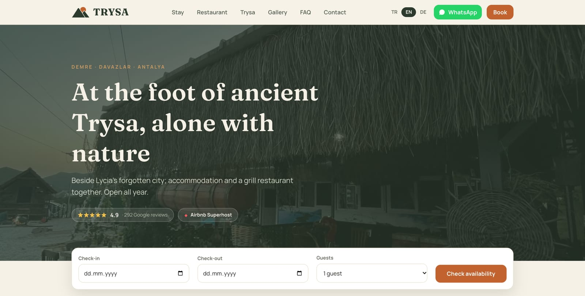
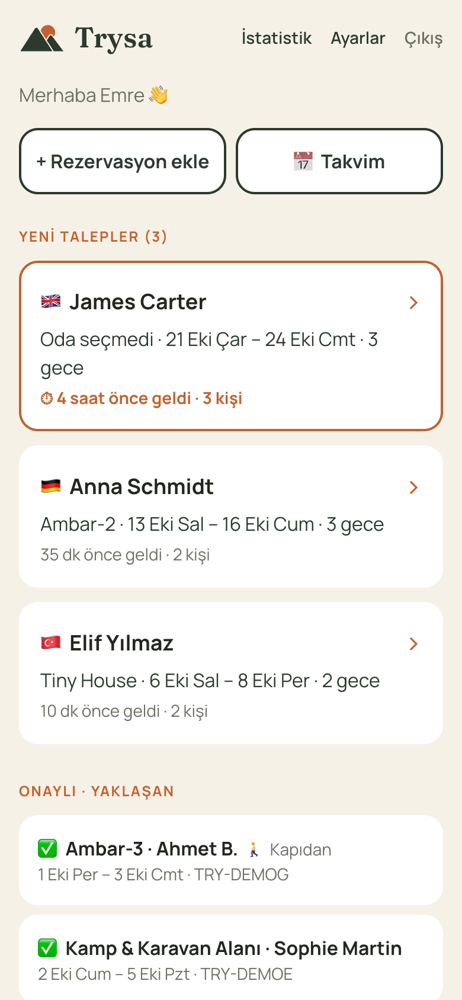
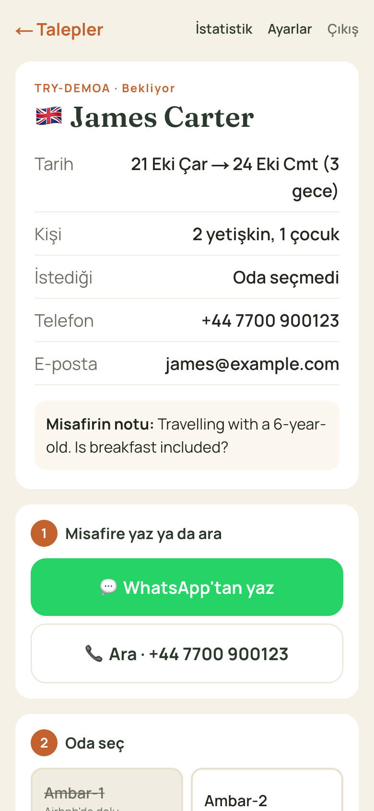
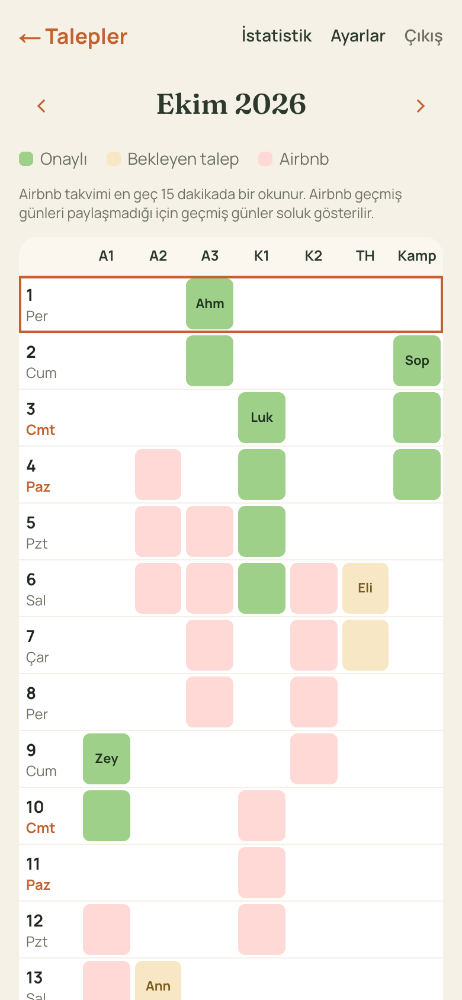
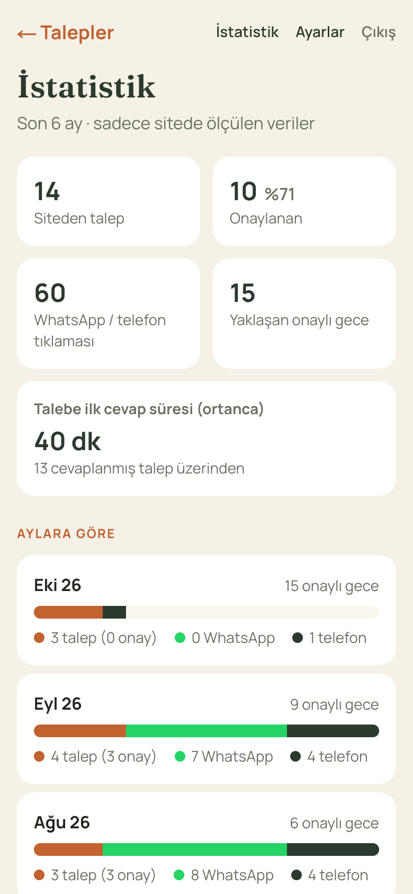
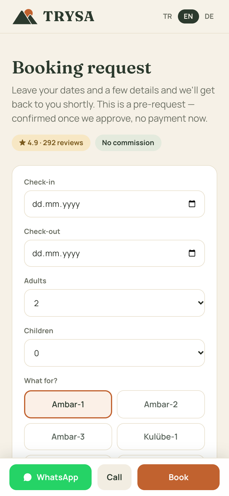
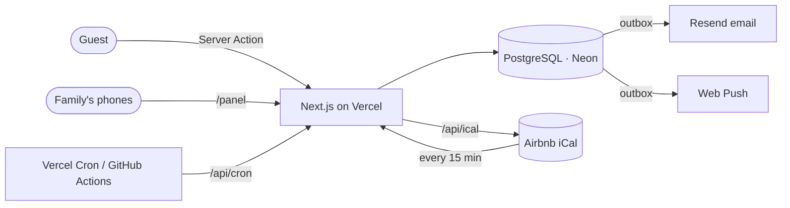

# Trysa: direct bookings for a family-run nature stay

[](https://github.com/sadikemreikiz/trysa-direct-booking/actions/workflows/ci.yml)
[](https://trysacamping.com)

Website, booking system and staff panel for **Trysa Restaurant Camping**, my family's small guesthouse and restaurant in Demre, Antalya: six wooden rooms and cabins, a tiny house, a camping area and a grill restaurant. It is live at [trysacamping.com](https://trysacamping.com), and the family handles incoming requests from its staff panel.



## The problem

Guests found Trysa on Airbnb, which takes a commission, or on Google, and then called or messaged the family to ask about rooms. Bookings arrived through several channels at once and were hard to keep track of, and there was no single place where a guest could see the rooms and simply ask for dates.

My goal is one place that represents the whole business, where guests can easily book a stay today and, later, order food from the restaurant. The booking part had to be a direct channel that:

- a non-technical family can run entirely from their phones,
- never double-books a room that is also listed on Airbnb,
- never loses a request, even when email or a phone is unreachable,
- works for international guests in Turkish, English and German.

## My role

I built and run this on my own: gathered requirements with the family, chose the architecture and stack, wrote the code with tests, and set up and operate the production infrastructure (domain and DNS, email domain verification, Google Cloud and Business Profile, Vercel, Neon). I developed it with an AI pair programmer (Claude Code), which I used for implementation speed; the product decisions, trade-offs and reviews are mine and are written down in [`docs/decisions`](docs/decisions).

## What it does

**For guests** (Turkish, English, German)

- Rooms, restaurant menu, gallery, FAQ and the live Google rating and reviews
- A booking form with an availability calendar per room: nights taken on Airbnb or confirmed directly are shown as booked, the stay can only end on the morning of the next booking, and the server re-checks on submit. Keyboard and screen-reader accessible (WAI-ARIA date grid)
- Dates chosen on the home page or a room page carry over into the form
- Branded emails in their language along the stay: request received, booking confirmed (sent when the family confirms), directions and arrival times the day before arrival, and after check-out one review request for guests who opted in on the form

**For the family** (staff panel at `/panel`, mobile-first, installable as a PWA, in Turkish)

- Google sign-in plus an explicit approval step: signing in alone grants nothing
- A push notification on every new request, and a reminder if a request waits more than 3 hours
- Confirm or decline with a room picker that shows what is free, and ready-made WhatsApp replies in the guest's language
- Phone, WhatsApp and walk-in bookings added by hand, so every booking lives in one place
- A monthly occupancy calendar across all rooms and Airbnb
- Statistics from measured data only: requests, confirmation rate, median first-response time, clicks, nights sold
- An iCal feed per room, so Airbnb blocks dates sold directly

<table>
  <tr>
    <td></td>
    <td></td>
    <td></td>
    <td></td>
    <td></td>
  </tr>
  <tr>
    <td align="center"><sub>Requests</sub></td>
    <td align="center"><sub>Request detail</sub></td>
    <td align="center"><sub>Occupancy calendar</sub></td>
    <td align="center"><sub>Statistics</sub></td>
    <td align="center"><sub>Availability calendar</sub></td>
  </tr>
</table>

<sub>Panel screenshots use the fictional demo data from `npm run db:seed`, not real guests.</sub>

## Architecture



| Layer     | Choice                                                                                             |
| --------- | -------------------------------------------------------------------------------------------------- |
| App       | Next.js 16 (App Router, Server Components, Server Actions), React 19, TypeScript, Tailwind CSS 4   |
| Data      | PostgreSQL on Neon (Frankfurt), Drizzle ORM, versioned SQL migrations applied on production builds |
| Auth      | Better Auth with Google, sessions in the database                                                  |
| Messaging | Resend (email), Web Push with VAPID                                                                |
| Tests     | Vitest + PGlite (real Postgres in WebAssembly), GitHub Actions CI                                  |
| Hosting   | Vercel (functions in `fra1`, next to the database)                                                 |

Public pages are statically generated with incremental revalidation; the booking page is revalidated on demand when staff confirm or cancel. A failed migration fails the deploy, so the previous version stays live.

## Engineering decisions

The full reasoning, alternatives and costs are in [`docs/decisions`](docs/decisions).

| Problem                              | Approach                                                                                                                                                                                                                        |
| ------------------------------------ | ------------------------------------------------------------------------------------------------------------------------------------------------------------------------------------------------------------------------------- |
| Airbnb's calendar lags by hours      | Guests send a **request** that a human confirms, instead of instant booking ([ADR 0001](docs/decisions/0001-booking-requests-not-instant-booking.md))                                                                           |
| Double bookings under concurrency    | An `EXCLUDE USING gist` constraint on `(unit_id, daterange)` for confirmed bookings; the database rejects overlaps even under concurrent writes ([ADR 0002](docs/decisions/0002-database-constraint-against-double-booking.md)) |
| Two people acting on one request     | A small state machine applied with conditional `UPDATE … WHERE status = expected`; the second click gets "already handled". Every change goes into an audit log                                                                 |
| Lost notifications                   | **Transactional outbox**: booking, audit event and notification rows in one transaction; delivery with a lease and exponential backoff ([ADR 0003](docs/decisions/0003-transactional-outbox-for-notifications.md))              |
| Emails sent twice by a scheduled job | Each outbox row can carry an idempotency key (`guest_prearrival:<booking id>`, unique in the database). The job runs every 15 minutes, inserts with `ON CONFLICT DO NOTHING` and only between 10:00 and 20:00 in Demre          |
| No Airbnb API for small hosts        | Two-way sync over iCal: read each room's Airbnb calendar, publish a tokenised feed of direct bookings ([ADR 0004](docs/decisions/0004-two-way-airbnb-sync-over-ical.md))                                                        |
| Spam without CAPTCHA friction        | Honeypot, minimum fill time and a Postgres fixed-window rate limit keyed by an HMAC of the IP ([ADR 0006](docs/decisions/0006-spam-protection-without-captcha.md))                                                              |
| Privacy (KVKK/GDPR)                  | Cookie-free analytics, no IPs stored, and a scheduled job that anonymises booking data 2 years after the stay, as the privacy policy promises                                                                                   |
| Graceful degradation                 | Without a database the site still takes requests by email; without Google it shows the last known rating                                                                                                                        |
| Security headers                     | CSP with no third-party scripts, `frame-ancestors 'none'`, HSTS, `nosniff`, strict referrer and permissions policies                                                                                                            |

## Quality

- **84 tests** (unit and integration) run against PGlite with the production migrations, so constraints, races between workers and retry timing are tested for real, with no mocks of the database and no Docker ([ADR 0005](docs/decisions/0005-real-postgres-in-tests-with-pglite.md)).
- **CI** runs lint, type checks, tests and a production build without any secrets on every push.
- **Performance:** photos went from 26 MB to 11.6 MB with responsive sizes; on a phone the home page downloads about 0.9 MB of images instead of 8.5 MB.
- **SEO:** per-page canonical URLs and `hreflang`, localized JSON-LD (`LodgingBusiness` + `Restaurant`, FAQ), a sitemap with language alternates.

## Running locally

Requires Node 24 (see `.nvmrc`).

```bash
npm install
cp .env.example .env.development.local   # then set BETTER_AUTH_SECRET
npm run db:local     # local Postgres (PGlite) on 127.0.0.1:5433 with migrations; keep it running
```

Then, in a second terminal:

```bash
npm run db:seed      # fictional demo bookings, so the panel has something to show
npm run dev          # http://localhost:3000
```

To open the panel without Google, `node --env-file=.env.development.local scripts/dev-login.mjs` prints a session cookie for a local admin (it refuses to run against a non-local database). Set it as `better-auth.session_token` for `localhost` and open `/panel`.

```bash
npm run check        # lint, formatting, types and all tests, as in CI; no database or keys needed
```

Only the database and the auth secret are required. Every other integration (Google sign-in, email, push, Airbnb calendars, Google reviews) switches off cleanly when its variables are empty; [`.env.example`](.env.example) documents each one.

## Project structure

The code is organised by feature: each folder under `src/features` holds a domain's server logic, actions, UI components and tests together, so a feature can grow (or a new one such as restaurant orders can be added) without touching the others.

```
src/
  app/                    routes only: public site (tr/en/de), staff panel, API endpoints
  features/
    booking/              request validation and storage, form action, spam limits, guest form
    airbnb-sync/          Airbnb calendar import and the iCal feed Airbnb imports
    notifications/        transactional outbox delivery, email, guest receipts, Web Push
    panel/                status changes, access control, calendar, statistics, panel UI
    maintenance/          scheduled jobs: reminders and data retention
    analytics/            cookie-free conversion events
    reviews/              live Google rating and reviews
  content/                site facts, menu and prices, privacy policy, TR/EN/DE dictionaries
  components/             shared UI (header, footer, logo) and the home page sections
  db/                     Drizzle schema, connection and the PGlite test database
  lib/                    cross-cutting helpers: auth, i18n, SEO, dates, images
drizzle/                  versioned SQL migrations
scripts/                  local database, demo data, dev sign-in, image optimisation, migrations
docs/decisions/           architecture decision records
```

The code, comments and documentation are in English. URLs stay Turkish (`/rezervasyon`, `/oda/…`, `/panel/takvim`) on purpose: they are part of the product for a Turkish business, already indexed by Google, and saved on the family's phones.

## What's next

- End-to-end tests of the guest booking and panel confirmation flows (Playwright)
- Error monitoring and alerting
- An AI concierge that answers guest questions and checks real availability through tool calls, with an evaluation set
- Online food ordering from the restaurant, plus a QR menu with prices managed from the panel

## License

The source code is published to show my work; it is not open source. Code © Sadik Emre Ikiz; photos, texts, the Trysa name and logo © Trysa Restaurant Camping. All rights reserved, see [LICENSE](LICENSE).
